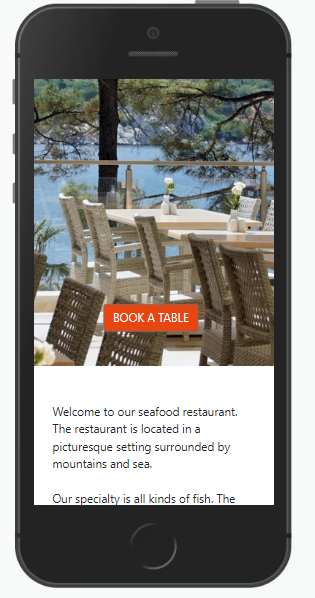

# A restaurant booking system
This is a website for a restaurant. The main purpose of the website is to allow customers to make bookings. They can also cancel and edit bookings.

# Table of contents

- [UX](#ux)
    - [Website owner business goals](#website-owner-business-goals)
    - [User goals](#user-goals)
    - [User stories](#user-stories)
    - [Structure of the website and wireframe](#structure-of-the-website-and-wireframe)
    - [Surface](#surface)
- [Database and data schema](#database-and-data-schema)
- [Technologies](#technologies)
- [Testing](#testing)
    - [Functionality testing](#functionality-testing)
    - [Responsiveness testing](#responsiveness-testing)
    - [Code validation](#code-validation)
    - [Accessibility and performance](#accessibility-and-performance)
    - [Unfixed bugs](#unfixed-bugs) 
- [Deployment](#deployment)
- [Credits](#credits)

# UX

## Website owner business goals
- The site owner would like the ability to take online bookings for their eatery.

## User goals
- The user would like to book one or more guests for a meal in a restaurant and a particular time and date.

## User stories
We implemented 11 user stories:
- General info: As a **site user** I can **find general information about the restaurant** so that **I can decide if I want to eat there**
- Contact info: As a **site user** I can **find contact information** so that **I can get in touch with the restaurant**
- Add/remove tables: As a **site admin** I can **add or remove tables** so that **the booking system works**
- View bookings: As a **site admin** I can **view the bookings** so that **I can plan the day**
- Booking form: As a **site user** I can **fill out an online form** so that **I can choose a date and time for my visit**
- View booking: As a **site user** I can **view the booking** so that **I know if my booking is confirmed**
- Account registration: As a **site user** I can **register an account** so that **I can update or delete a booking**
- Download menu: As a **site user** I can **download the menu** so that **I know what kind of food the restaurant serves**
- Delete booking: As a **registered user** I can **cancel my next booking**
- Map: As a **site user** I can **can see the location of the restaurant on an interactive map** so that **I can easily find it**
- Update booking: As a **site user** I can **update my next booking** so that **I can change the number of people, date, and time**

## Structure of the website and wireframe
The website was wireframed with paper and pen. The original design is shown in the picture below:

It was decided early on that the website would consist of four main pages.
- The home page with a photography of the restaurant and a booking button covering two thirds of the screen and an about section in the remaining part.
- A contact page with contact information and an interactive map showing the location of the restaurant.
- A form page with the booking form.
- A booking page showing the customer's next booking in case he made several. The booking card has one delete and one update button.
Three pages handling sign up, sign in, and sign out were later added. 

## Surface

### Colors
- Background color: White (#fff)
- Color of buttons: Orange (#e84610) from the Code Institute InteractiveFrontEndDevelopment-Resume walkthrough project.

### Fonts

We used the Google fonts Roboto and Lato following the Code Institute walkthrough project Django3blog.

### Icon

The icon comes from https://publicdomainvectors.org/

[Back to Table of contents](#table-of-contents)

# Database and data schema
We used the buit-in postgreSQL database of Heroku. The tables in the database were mapped to classes (models) in the back-end python program. The data schema is shown below:

There is three tables. One recording the customers, one for the bookings and one for the tables (of wood, not a database table).
One customer can make several bookings (one to many relationship) and one table can be booked by several parties (also a one to many relationship). A booking can in principle include several tables but for simplification we allowed only one table per booking. It can also be problematic to move tables around. We also used the Django User model which contain user information.

[Back to Table of contents](#table-of-contents)

# Technologies
- HTML5 for structuring content
- CSS including Bootstrap 5 for styling content
- JavaScript for front-end interactivity
- Python and Django for back-end programming
- Github for cloud-based storage of project
- GitPod for development
- Git for version control

[Back to Table of contents](#table-of-contents)

# Testing

## Functionality testing
I did both automated and manual testing. I tested the python routines in routines.py with django.test. The tests are in test_routines.py. They mainly tested the validation of the booking form and the routines looking for free seats. I tested the views in views.py manually. I had a bug when creating an already existing customer which is impossible since each customer has to be unique. The form.is_valid method returned False for the customer form if the customer already existed in the database. The solution was to remove form.is_valid for the customer form but not for the booking form.

## Responsiveness testing
I tested the site on several virtual devices using devtools. I also tested it on my PC and on my mobile phone.

## Code validation
- The HTML files passed through the W3C validator without errors.
- The CSS file passed through the W3C validator without errors.
- The python files had four errors which were all strings that were too long. I tried to cut them in two but it gave rise to errors.

## Accessibility and performance

The accessibility score for my code was 98% according to lighthouse in devtools.

## Unfixed bugs
As I mentioned above I did not fix four lines that were too long. The pep8 validator reported many other lines but I was able to cut all of them. I did not manage to populate the booking time entry when editing a booking.

[Back to Table of contents](#table-of-contents)

# Deployment
The site was deployed to Heroku. The steps to deploy are as follows:
* Create a requirements.txt file containing all the libraries used in the project
* Create a Procfile that shows that the application is a web application
* In Heroku, set environment variables
* Get environment variables in setting.py
* Set debug mode to False so that no sensitive information is revealed because of debugging
* Push code to Heroku
* Run application
The URL of the deployed website is https://restaurantfarid.herokuapp.com/
The URL of the github repository is https://github.com/faridjos/restaurant

 [Back to Table of contents](#table-of-contents)

 # Credits
 - My main inspiration came from the Code Institute Django3blog walkthrough project and to some extent from the Code Institute InteractiveFrontEndDevelopment-Resume. I copied a few lines of code from those projects (see code).
 - The icon comes from https://publicdomainvectors.org/en/free-clipart/Round-restaurant-sign-vector-graphics/17938.html
 - The two photos are from Google (Creative Commons Licence): https://pxhere.com/en/photo/717385 and https://www.piqsels.com/en/public-domain-photo-zbkvd

 [Back to Table of contents](#table-of-contents)